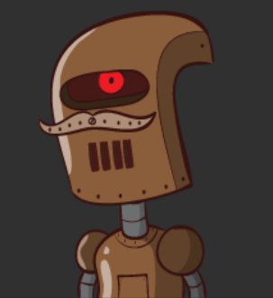
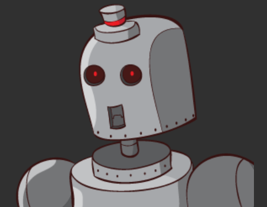

Robohash for Android!
==========================
[](https://travis-ci.org/neuhalje/android-robohash)

This library creates recognizable images of cute robots from hash values (or basically any other data). It is an adaption of Colin Davis'  code at [RoboHash.org](http:/RoboHash.org).



Why?
==========

Sometimes is necessary to create a _personality_ for data in your applications. A good example is an avatar for a user that has no photo attached.


How
----------------
See the [example project](https://github.com/neuhalje/android-robohash-example).

### Include android-robohash in build.gradle

```groovy
// ...
buildscript {
    repositories {
        jcenter()
    }
    // ...
}

// ...

dependencies {
    compile(group: 'name.neuhalfen.projects.android', name: 'android-robohash', version: '1.0.4', ext: 'aar')
}
```


### Calculate the image handle
* Pass in the hash (or an uuid) of the data you want to 'personalize'.
* Get a stable handle.
  * The handle is a 64bit long value suitable to store in a database.
  * The handle derivation is _pure_, that means you always get the same handle(value) for the same input. There are no side effects either.

```java
RoboHash robots = new RoboHash(getContext());
Handle immutableHandle = robots.calculateHandleFromUUID(uuid);
// Maybe persist the handle ...

```

### Get the robot!
* Pass in the handle to get the image. Images are currently 300x300 pixels.

```java
// Advice: Keep a global (Application) instance of RoboHash to enable caching.
RoboHash robots = new RoboHash(getContext());

Handle loadedHandle = ...
Bitmap bitmap = robots.imageForHandle(handle);

```

### Optionally
* Enable caching of calculated robots (advised, when they are used in lists)

```java
RoboHash robots = new RoboHash(getContext());
robots.useCache(mkCache());
// ...

private LruCache<String, Bitmap> mkCache() {
  int  maxMemory = (int) (Runtime.getRuntime.maxMemory / 1024);

  // Use 1/8th of the available memory for this memory cache.
  int cacheSize  = maxMemory / 8;
  LruCache<String, Bitmap> memoryCache = new LruCache<String, Bitmap>(cacheSize) {
    public int sizeOf(String key, Bitmap bitmap)  {
      // The cache size will be measured in kilobytes rather than
      // number of items.
      return bitmap.getByteCount() / 1024;
    }
  }
}
```
Example robots
-------------------




LICENSE && Contributors
==================
* Colin Davis -- Wrote the original [RoboHash](http:/RoboHash.org) in python
* Set 1 artwork created by Zikri Kader
* Set 2 artwork created by Hrvoje Novakovic
* Set 3 artwork created by Julian Peter Arias

The RoboHash images are available under the CC-BY-3.0 license.

The source code is available under the MIT license.

Publish AAR to bintray
=================

This is a reminder to myself:

```properties
# local.properties
bintray.user=<bintray user>
bintray.apikey=<bintray api key>
```

`./gradlew bintrayUpload`
